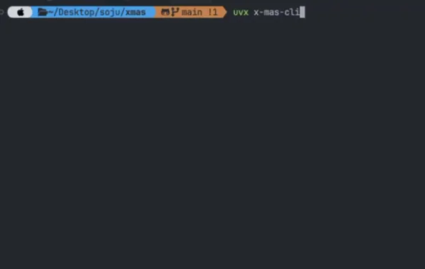

## x-mas-cli

A tiny terminal Christmas tree with falling snow, built with [Rich](https://github.com/Textualize/rich).

## Demo



## Run

From PyPI (no install, via `uvx`):

```bash
uvx x-mas-cli
```
